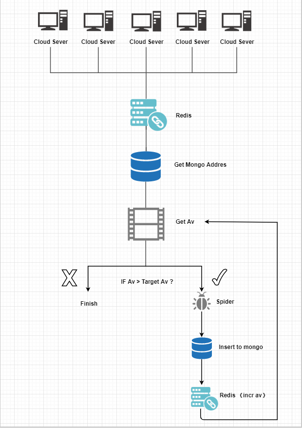
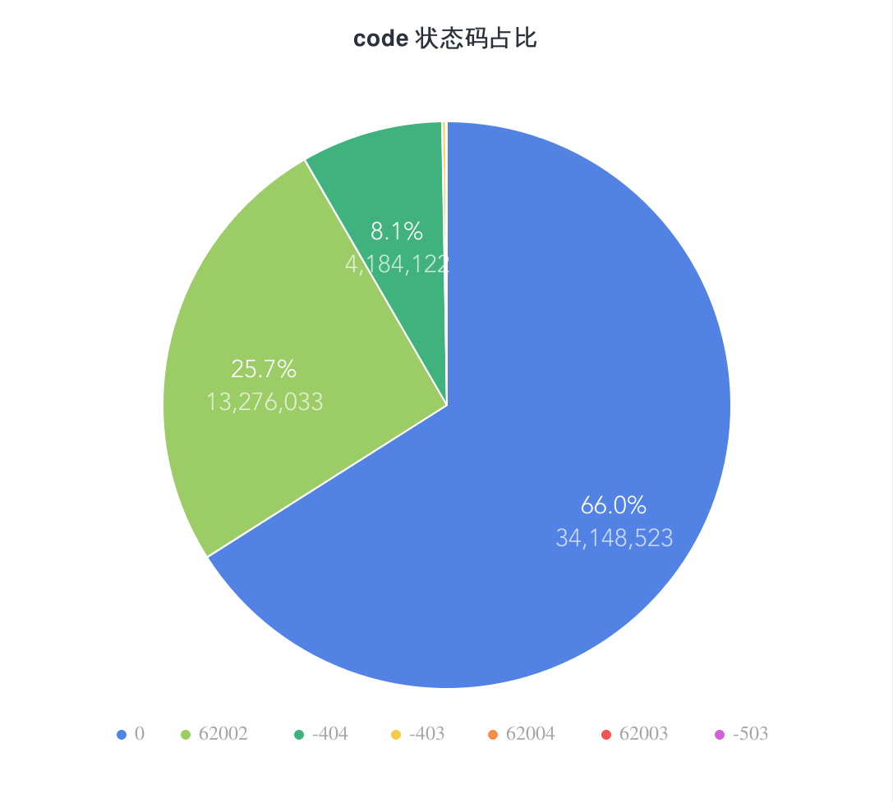

# Bilibili 视频数据分析


本项目是使用 Redis + Scrapy 开发的集群式爬虫, 爬取了视频 Av 号 __1 - 51746026__ 的所有视频信息
- [Spider 爬虫](#Spider-爬虫)
    - [爬虫环境](#爬虫环境)
    - [工作流程](#工作流程)
- [数据分析](#数据分析)
	- [视频状态概况](#视频状态概况)
	- [视频质量分析](#视频质量分析)
	- [视频分类分析](#视频质量分析)
		- [视频分类年度变化图](#视频分类年度变化图)
	- [视频数量年度变化分析](#视频数量年度变化分析)
	- [视频投稿数量 Top 50](#视频投稿数量%20Top%2050)
	- [视频标题分词分析](#视频标题分词分析)

    
项目块说明

目录 | 作者 | 说明
-|-|-
Video Count By Year | [@WuXieXie](https://github.com/WuXieXie) | 年度稿件数量 
Video Quantity Ranking | [@dirname](https://github.com/dirname) | 投稿数量 Top 50 
Video Ratio | [@WuXieXie](https://github.com/WuXieXie) | 稿件有效率 
Video Tag Ratio | [@WuXieXie](https://github.com/WuXieXie) | 稿件类型占比 
Video Tag Ratio By Year | [@WuXieXie](https://github.com/WuXieXie) | 年度稿件类型占比 

## Spider 爬虫
使用 Redis 管理递增 Av 号, 能减少网络堵塞等特定情况下数据的遗漏, 并允许多台机器同时工作爬行

### 爬虫环境
+ MongoDB Community 4.0
+ Scrapy 1.5.2
+ Redis 5.0.3
+ Python 3.7.3
+ CentOS 7

### 工作流程



## 数据分析
数据清洗完毕后, 数据概况
+ 总数据条数 `51746026` 条
+ 数据遗漏条数为 `0` 条
+ 采集字段为完整 `http://api.bilibili.com/x/web-interface/view?aid={$av}` 响应内容, 如下
```json
{"code":0,"message":"0","ttl":1,"data":{"aid":7777,"videos":2,"tid":30,"tname":"VOCALOID·UTAU","copyright":2,"pic":"http://i0.hdslb.com/bfs/archive/f6e477c256b53be9b973dcc8d6e0fc708b52a3c3.jpg","title":"[7777的怨念]リア充爆発しろ","pubdate":1274427960,"ctime":1497345655,"desc":"P1sm8630148手繪版 P2 sm8613443原曲 リア充=現充，即現實生活充實，大多數有妹子，成天沐浴在陽光之下的人生淫家，反義詞即我們這種成天坐在電腦前的家裡蹲死宅 ，此曲則是nico眾死宅發洩對現充表示詛咒、嘲諷(還有x慕)等等情緒的曲子。投稿一周即再生10w突破","state":0,"attribute":49152,"duration":93,"rights":{"bp":0,"elec":0,"download":1,"movie":0,"pay":0,"hd5":0,"no_reprint":0,"autoplay":1,"ugc_pay":0,"is_cooperation":0,"ugc_pay_preview":0},"owner":{"mid":925,"name":"911","face":"http://i1.hdslb.com/bfs/face/f08bbe3e475caad4f557237bb2ebb4b8c53e4e84.jpg"},"stat":{"aid":7777,"view":20135,"danmaku":259,"reply":309,"favorite":280,"coin":34,"share":49,"now_rank":0,"his_rank":0,"like":123,"dislike":0},"dynamic":"","cid":11638,"dimension":{"width":0,"height":0,"rotate":0},"no_cache":false,"pages":[{"cid":11638,"page":1,"from":"vupload","part":"sm8630148 手绘版","duration":93,"vid":"","weblink":"","dimension":{"width":0,"height":0,"rotate":0}},{"cid":11639,"page":2,"from":"vupload","part":"sm8613443 原曲","duration":90,"vid":"","weblink":"","dimension":{"width":0,"height":0,"rotate":0}}],"subtitle":{"allow_submit":false,"list":[]}}}
```

### 视频状态概况

__code 状态码__

使用聚合得到


占比图



### 视频质量分析

根据 `code = 0` 的占比, 同样可得出, 具有权限可观看的视频稿件数量为 __34,148,523__ 个, 视频不见了 `code -404` 的数量为 __4,184,122__ 个, 稿件不可见 `code=62002` 的数量为 __13,276,033__ 个

占比图


能访问的视频达到 __66 %__ , 说明哔哩哔哩的视频内容是充实的

### 视频分类分析

总共有 __96 种__ 类别, 其中数量最多的是 `单机游戏`, 具体数量参考 [Video Tag Ration/data.txt](https://github.com/dirname/Bilibili-Av-Videos-Analysis/blob/master/Video%20Tag%20Ratio/data.txt)

图表


饼图


#### 视频分类年度变化图


### 视频数量年变化分析

年份 | 视频数量
-|-
2009 | 466
2010 | 23502
2011 | 79054
2012 | 123293
2013 | 240073
2014 | 425229
2015 | 857852
2016 | 2540810
2017 | 6326099
2018 | 14477304
2019 | 9054916

变化折线图


可以看到从 __2009年__ - __2019年5月7日 19:34:52__, __2018年__ 的视频数量达到 `14,477,304`个, 处大幅度增长的趋势

### 视频投稿数量 Top 50

UID | 昵称 | 投稿数量
-|-|-
4652742 | leoleeyana | 38191
381738 | M.Scarlet | 24297
2370944 | 多玩首发帝 | 18449
477132 | TAKERA | 18257
382675 | 全麦面包V5 | 17800
535734 | 空想水晶诅咒绯红锁链 | 17251
4005201 | YCZGR | 16682
136001 | ldj7 | 14491
956291 | TF2Video | 14288
6049045 | 井尻晏菜 | 13506
10618733 | Oriequat | 11300
278174078 | daheyouda | 10758
221648 | 柚子木字幕组 | 10734
19653 | 小清水亜美 | 10344
60631692 | 非凡娱乐 | 9889
326632524 | 一点空间ydkj400 | 9592
18094086 | 楊沫沫 | 9532
111187301 | 特摄宅男狼少主 | 9258
44537723 | asdbao | 9147
390668899 | 好猫电娱 | 8910
29246903 | 柏原Dellen | 8746
40904879 | 磨蹭蹭蘑菇 | 8677
1324413 | 牛牛蝎羯 | 8633
2610451 | gy缪德塞克 | 8431
4676168 | Yikori | 8363
12730937 | jojo2w | 8257
928123 | 哔哩哔哩番剧 | 8168
1904149 | darkvroverSC2 | 8109
260439888 | 民福康三甲科主任 | 8044
22141207 | 独游魔盒 | 7738
8607832 | 丫头琦 | 7726
350227828 | 一点空间教育官网 | 7535
268536810 | 火播君 | 7461
429251 | 大宝剑联盟 | 7145
11060066 | 偶像船长 | 7027
11025317 | 斑鸠心平气和everyday | 6989
22972219 | yanghao98 | 6897
14997238 | DJTAKERA | 6848
51606885 | VIC56_CC | 6634
12691609 | BeautiesClub | 6619
797614 | 赫_一号机 | 6556
2062760 | 一把近战都不给六花 | 6508
60058 | 阿尔法小分队字幕组 | 6380
90452309 | 林北是国民女装大佬 | 6357
101710446 | 叭乐叭乐 | 6300
40568377 | 黄大咖2016 | 6294
325406 | 一直喵OneStraightCat | 6180
768041 | CJ木 | 6146
2303935 | GP81每日KPOP | 6088
218084 | 鱼翅旺馒 | 6075

图表


### 视频标题分词分析

Analyzing, coming soon........


### 视频弹幕、硬币、评论等属性数量分析

Analyzing, coming soon........